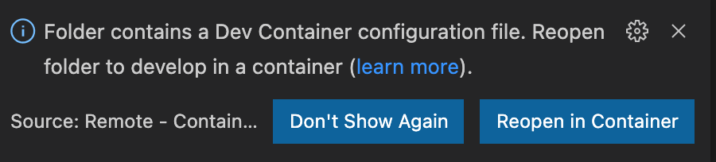

# Prerequisites

#### VS Code

Install VS Code and the Remote Containers extension. The Remote Containers extension allows you to develop code inside a docker container.

https://marketplace.visualstudio.com/items?itemName=ms-vscode-remote.remote-containers

#### Docker

Install docker for window, linux, or mac. When you work with dev containers in Visual Studio Code, you are leveraging the capabilities of Docker to create isolated development environments using container images. To create and manage these containers, the Docker daemon must be running on your system. The Docker daemon is responsible for building, running, and managing containers.

Ensure Docker has enough resources, in particular memory, otherwise some commands may fail. 8Gb should be enough for at least 1 environment.

**Docker Login**

Authenticate with harbor to access the IQGeo docker registry. To authenticate, use the docker CLI:

```shell
docker login harbor.delivery.iqgeo.cloud
```

To use the docker CLI to login, you will need to obtain your CLI secret (password) from your user profile found in harbor:
https://harbor.delivery.iqgeo.cloud

# Setup

#### Directory Structure

-   \<parent\>
    -   .devcontainer
    -   .vscode
    -   my_module

### Authentication

Authentication by default is setup to use Keycloak. To use Keycloak, add an entry to your hosts file to resolve the Keycloak URL to your local machine. Add the following line to your system's `hosts` file:

```shell
127.0.0.1    keycloak.local
```

# Starting a Development Container (Local docker)

Note: This section assumes Docker is running locally on your machine. For running development containers on a Development Server, please follow the [remote host README](remote_host/README.md)

The **Visual Studio Code Remote - Containers** extension lets you use a Docker container as a full-featured development environment. It allows you to open any folder inside (or mounted into) a container and take advantage of Visual Studio Code's full feature set. The development container for Network Manager Comms contains Python, NodeJS, IQGeo Platform, and other tools and libraries to facilitate the development of the app.

### Overriding ENV variables

Overriding of environment variables in the `docker-compose.yml` can be done via `.env` file in this folder. Copy the `.env.example` file to `.env` and modify the values as described in its comments.

### Connecting To Containers From Host

The APP_PORT and DB_PORT parameters are used to map Apache and PostgreSQL to ports on your local machine (Docker Port Mapping). This allows you to connect to Apache on http://localhost:APP_PORT and PostgreSQL via a PSQL client.

```shell
psql -u DB_USERNAME -h localhost -p DB_PORT
```

NOTE: These ports are only exposed on the Docker Host (e.g. your local machine). Inside the docker network, Apache and PostgreSQL are exposed on their default ports (80 and 5432).

### Open Dev Container in VS Code

Login to Harbor using the **docker login** commands above. This allows VS Code to pull the IQGeo Platform image from Harbor.

With VS Code, open the \<parent\> folder. VS Code will then prompt you to open the folder in a dev container. Choose _Reopen in Container_.



VS Code will then begin building the development container. This might take a few minutes), get up and stretch!

Now create the dev database. From the _Terminal_ menu, select _Run Task..._ and then _Build Database_.

After the database has finished building, you now have a fully functioning application! From your local machine, use a browser to access http://localhost:_APP_PORT_

# Troubleshooting

## I get an error when the myw_product build command runs

Try increasing the memory available to Docker
