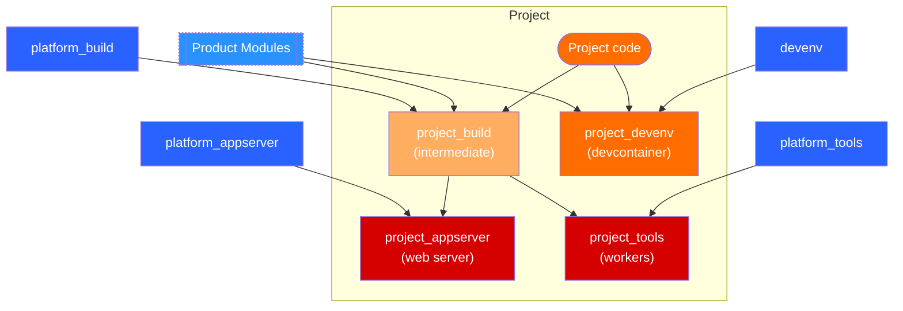

# Project Name

Project description

- [Project Name](#project-name)
  - [Development](#development)
    - [Running a dev environment on Windows](#running-a-dev-environment-on-windows)
  - [GitHub Actions Configuration](#github-actions-configuration)
    - [Required Variables](#required-variables)
    - [Required Secrets](#required-secrets)
  - [Deployment](#deployment)
  - [Container images hierarchy](#container-images-hierarchy)

## Development

Check out the [development README](.devcontainer/README.md) for instructions on how to build and run the development environment.

### Running a dev environment on Windows

Using host-bound volumes when running linux containers on a windows host comes with considerable overhead. Using **myw_product build** and **myw_product watch** within a container becomes impractical. By following these steps, you will be able to checkout and access your source code within WSL2, and cut on the need to access the windows host at all.

[Developing with Containers on Windows](https://github.com/IQGeo/utils-project-template/wiki/Developing-with-containers-on-Windows)

## GitHub Actions Configuration

The project uses GitHub Actions workflows for building and pushing Docker images. The following variables and secrets must be configured in your repository settings to enable the Docker build workflow (`.github/workflows/docker_build.yml`).

### Required Variables

Configure these in **Settings > Secrets and variables > Actions > Variables**:

| Variable            | Description                          | Example                |
| ------------------- | ------------------------------------ | ---------------------- |
| `registry`          | Container registry URL               | `harbor.example.com`   |
| `repository`        | Repository path within the registry  | `myproject/containers` |
| `image_name`        | Base name for the Docker images      | `myproject`            |
| `registry_username` | Username for registry authentication | `robot-account`        |

### Required Secrets

Configure these in **Settings > Secrets and variables > Actions > Secrets**:

| Secret              | Description                                   |
| ------------------- | --------------------------------------------- |
| `registry_password` | Password or token for registry authentication |

## Deployment

Check out the [deployment README](deployment/README.md) for instructions on how to build and run the deployment environment.

## Container images hierarchy

The following diagram illustrates the container images generated generate and used by their dependencies. Images in blue are provided by Engineering. Images in red are to be used in the deployment of the project.

