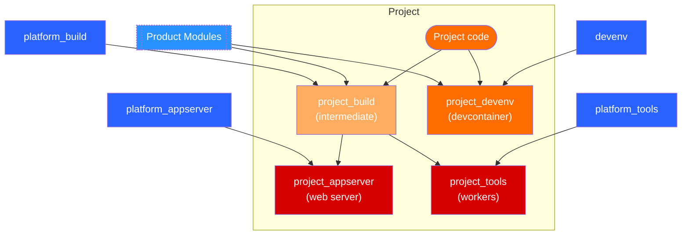

# Template repo for an IQGeo project/product/module

This template provides a starting point for creating a new IQGeo project/product/module.
It includes the following:

-   Development environment
    -   Dev container definitions
    -   VSCode tasks, settings and recommended extensions
-   Deployment configuration
    -   An `.iqgeorc.jsonc` file, which contains project information and other deployment settings 
    -   Container image definitions optimised for deployment
    -   Example docker-compose and instructions to build and run deployment docker containers

## Table of Contents

- [Template repo for an IQGeo project/product/module](#template-repo-for-an-iqgeo-projectproductmodule)
  - [Table of Contents](#table-of-contents)
  - [Template Usage](#template-usage)
    - [Create a new repository from this template](#create-a-new-repository-from-this-template)
    - [Apply this template to an existing repository](#apply-this-template-to-an-existing-repository)
  - [Configuring the project](#configuring-the-project)
    - [Notes on Product modules](#notes-on-product-modules)
      - [comms\_dev\_db:](#comms_dev_db)
    - [Updating the project files using the IQGeo VSCode extension](#updating-the-project-files-using-the-iqgeo-vscode-extension)
    - [Testing the configuration](#testing-the-configuration)
      - [Keycloak configuration](#keycloak-configuration)
      - [Harbor authentication](#harbor-authentication)
      - [Launching the containers of the dev environment](#launching-the-containers-of-the-dev-environment)
      - [Adjust entrypoints](#adjust-entrypoints)
      - [Launching the container connected to VSCode](#launching-the-container-connected-to-vscode)
      - [Commit and push](#commit-and-push)
  - [Review Additional Files](#review-additional-files)
    - [.devcontainer/README.md](#devcontainerreadmemd)
  - [Updating this Readme](#updating-this-readme)
  - [Container images hierarchy](#container-images-hierarchy)

---

## Template usage

You can use this template to create a new repository for an IQGeo project/product/module, or you can apply the template to an existing repository.

### Create a new repository from this template

To use this template when creating a new repository, follow these steps:

1. Click **Use this template** at the top of the repository page.
1. Select **Create a new repository**.
1. Provide a name and description for your new repository.
1. Clone your new repository to your local machine.

    - Alternatively, you can download the repository as a zip file and extract it to your local machine.

1. Create an initial commit.
1. Follow the steps in the section [Configuring the project](#configuring-the-project).

### Apply this template to an existing repository

**Note:** Your repository must have a folder for IQGeo modules, for example `custom`. Set up this structure *before* you apply the template.

1. Make sure your repository is pushed to a remote repository and that all changes are committed.
1. We recommend that you create a new branch to apply the template to.
1. Install the VS Code extension IQGeo Utils (optional). The extension is available from the Visual Studio Marketplace: [IQGeo Utils extension](https://marketplace.visualstudio.com/items?itemName=iqgeo.utils)
1. Do you have the IQGeo VSCode extension installed?
   - If *yes*, use the command "IQGeo Pull and merge files from project-template" to apply the template to your repository.
   - If *no*, you can download the zip file of the project repository and extract it to a temporary location. Copy the contents from the extracted folder to the root of your repository, *except* the `custom` folder (you should already have a folder for the module you're working with in your existing repository).
1. Review all changes. Applying the template might overwrite some files in your repository. If there is configuration that you want to keep, you can recover it using git (described in the section [Updating the project files using the IQGeo VSCode extension](#updating-the-project-files-using-the-iqgeo-vscode-extension).
1. Go to the section [Configuring the project](#configuring-the-project).

## Configuring the project

To configure the project, you'll review and update the `.iqgeorc.jsonc` file to match your project settings and dependencies. 
Before you update the file, check the following section for module requirements.

### Product module requirements

The `.iqgeorc.jsonc` file provides a way to specify the IQGeo products to be included in the project. This is done by adding entries to the `modules` array. 

For a list of product modules, their versions, and the required dependencies, see the following topic:
[Module dependencies](https://github.com/IQGeo/utils-project-template/wiki/Module-dependencies)

Some modules have additional requirements as described in the following sections.

#### comms_dev_db:

- For dev environments only.  In the `.iqgeorc.jsonc` file, include `"devOnly": true` in the properties for this module. 
- You must include both the `comms` and `comsof` modules in the project.
- If there's no db with an NMT schema, and you want to create the comms_dev_db on startup of the container (following deployment), replace the contents of the file `.devcontainer/entrypoint.d/600_init_db.sh` with:
  
      #!/bin/bash
      if ! myw_db $MYW_DB_NAME list versions --layout keys | grep myw_comms_schema | grep version=; then $MODULES/comms_dev_db/utils/comms_build_dev_db --database $MYW_DB_NAME; fi

### Update the project files using the IQGeo VSCode extension

After you edit the `.iqgeorc.jsonc` file to make it specific to your project, you should run the command to update project files. This automatically updates related files that are used during the deployment process. The automatic update means you don't have to edit multiple files and ensures consistency across your project.

1. If you haven't already, install the VS Code extension IQGeo Utils (optional). The extension is available from the Visual Studio Marketplace: [IQGeo Utils extension](https://marketplace.visualstudio.com/items?itemName=iqgeo.utils)
1. Run the IQGeo Utils extension command **IQGeo Update Project from iqgeorc.jsonc**. You can right-click the `.iqgeorc.jsonc` file or its contents to get the command in the context menu.
1. Using a git client, review the changes made to the repository.
    - Recover (discard changes) that remove lines required for your specific project, for example, specific environment variables or specific commands in Dockerfiles.
    - Recover (discard the removal of) additional entrypoint files you still need for your project.
    - Keep your repository as close to the template as possible. This makes it easier to update the project in the future.
1. Commit the changes.
1. Test the changes and adjust them as necessary as described in the section [Testing the configuration](#testing-the-configuration).
   

### Testing the configuration

This section describes how to test the configuration using the development environment. 
Note: when using a remote host (development server), you'll need to follow the [instructions for the development environment on the remote host](.devcontainer/remote_host/README.md). 

#### Keycloak configuration

The dev environment is configured to use Keycloak for authentication. This requires you to add an entry to your hosts file to resolve the Keycloak URL to your local machine. Add the following line to your system's `hosts` file:
      `127.0.0.1    keycloak.local`

#### Harbor authentication

Authenticate with docker registry: `docker login harbor.delivery.iqgeo.cloud`
You will need to obtain your CLI secret (password) from your user profile found in harbor: https://harbor.delivery.iqgeo.cloud

#### Launching the containers of the dev environment

To launch the containers of the dev environment run: 

        `docker compose -f ".devcontainer/docker-compose.yml" --profile iqgeo up -d --build `.

The main process of the container runs as the `www-data` user but to run commands you should use the `iqgeo` user. To do this run: 

        `docker exec -u iqgeo -it <container_name>  bash`

<container_name> will be `iqgeo_<prefix>` where `<prefix>` is the value of prefix in the `.iqgeorc.jsonc` file. If you haven't updated it, it will be `iqgeo_myproj`

#### Adjust entrypoints

Add any necessary entrypoints to `.devcontainer/entrypoint.d` and `deployment/entrypoint.d` for your modules or the product modules

#### Launching the container connected to VSCode

To launch the container connected to VSCode, open the command palette in VSCode. Then search for and select `Remote-Containers: Reopen in Container`. This will open a new VSCode window connected to the container.

#### Commit and push

After successfully testing the configuration, commit and push your changes to the new repository. If this was an existing repository, ask others to review the changes and test the configuration before merging the changes to the main branch.

## Review Additional Files

After your initial setup you should review and update the following files to ensure that the project is properly configured for your needs:

### .devcontainer/README.md

1. Within the `.devcontainer/README.md `, Update the module name and database name to match your project's module and database name.
2. If there are any specific tasks that need to be run to build the database once the development container is running, add them to the `.devcontainer/README.md` file. This will ensure that other developers working on the project know how to build the database.

## Updating this Readme

Once you have followed the instructions above, you can edit this file so it becomes a Readme for your project/module/product:

-   update the sections below to describe your project
-   Replace the content of this file with the contents of the `PROJECT_README.md` file in the root of the repository, delete that file and commit the changes.
  

## Container images hierarchy

The following diagram illustrates the container images generated generate and used by their dependencies. Images in blue are provided by Engineering. Images in red are to be used in the deployment of the project.

The appserver image provides the runtime environment for application services, while the tools image serves as a container for executing command line instructions and also for hosting workers for long-running tasks.

