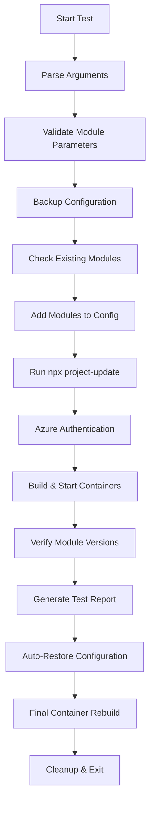

# Add Module Test Script

## Overview

The `test_add_module.sh` script automates the testing of module addition functionality in the IQGeo Utils-Project-Template by performing the following key actions:

1. **Backs up the original** `.iqgeorc.jsonc` configuration file
2. **Validates module parameters** ensuring proper name/version format
3. **Adds one or more modules** to the modules section in `.iqgeorc.jsonc`
4. **Runs `npx project-update`** to apply configuration changes to the repository
5. **Authenticates with Azure** Container Registry for module access
6. **Builds and starts** the development environment with new modules
7. **Verifies module versions** in the running container environment
8. **Auto-restores original configuration** and rebuilds for clean state
9. **Generates comprehensive test reports** showing pass/fail status for each step

The script validates the complete module addition workflow from configuration modification through deployment verification, ensuring modules can be successfully integrated into the development environment.

## Purpose

This script provides automated quality assurance for the module addition process, specifically testing:
- Configuration file modification and validation
- Module parameter validation and duplicate detection
- Project update integration with new modules
- Container deployment with added modules
- Module version verification in running environment
- Configuration restoration and cleanup processes

## Core Functionalities

### 1. **Configuration Management**
- Automatic backup and restoration of `.iqgeorc.jsonc`
- Safe modification of JSON configuration with validation
- Duplicate module detection and user confirmation
- Support for multiple modules in single operation

### 2. **Module Validation**
- Module name format validation (alphanumeric, underscore, hyphen)
- Version format validation (flexible versioning support)
- Parameter pair validation (name/version pairs required)
- Existing module conflict detection

### 3. **Development Environment Integration**
- Azure Container Registry authentication
- Docker Compose container orchestration
- Project update execution and validation
- Container health monitoring and verification

### 4. **Module Verification**
- Runtime module version checking in containers
- Package installation validation
- Module availability confirmation
- Comprehensive verification reporting

### 5. **Test Result Tracking**
- Step-by-step success/failure tracking
- Detailed verification results with statistics
- Color-coded output for easy result identification
- Automatic cleanup and restoration on completion

## Test Workflow



## Command Usage

### Basic Module Addition
```bash
cd /path/to/qa_test_automation
chmod +x test_add_module.sh

# Add single module
./test_add_module.sh workflow_manager 4.0

# Add multiple modules
./test_add_module.sh groups 1.0 workflow_manager 4.0 analytics 2.1.5

# Add modules with pre-release versions
./test_add_module.sh analytics pre-release reporting 2.1.5
```

### Advanced Options
```bash
# Skip building containers (config only)
./test_add_module.sh --skip-build groups 1.0 analytics 2.1.5

# Skip verification step
./test_add_module.sh --skip-verify custom 1.0 reporting 3.0

# Skip project update (manual control)
./test_add_module.sh --skip-update workflow_manager 4.0

# Test without auto-restore
./test_add_module.sh --no-auto-restore workflow_manager 4.0

# Restore configuration and rebuild
./test_add_module.sh --restore
```

### Configuration Management
```bash
# Use custom configuration file
./test_add_module.sh --file /path/to/.iqgeorc.jsonc groups 1.0

# Skip final rebuild but restore config
./test_add_module.sh --skip-final-rebuild groups 1.0

# View current modules
grep -A 20 '"modules"' ../.iqgeorc.jsonc
```

### Container and Module Inspection
```bash
# Check running containers
docker ps

# Verify module in container
docker exec iqgeo_myproj npm list --depth=0

# Check container logs
docker logs iqgeo_myproj

# Inspect module installation
docker exec iqgeo_myproj ls -la /opt/iqgeo/platform/WebApps/myworldapp/modules/
```

## Success Scenarios

### ✅ **Test Passes When:**

1. **Configuration Operations Succeed**
   - `.iqgeorc.jsonc` file exists and is writable
   - Backup creation completes successfully
   - Module parameters are valid (name/version format)
   - JSON modification preserves file structure

2. **Project Integration Works**
   - `npx project-update` executes without errors
   - Module dependencies resolve correctly
   - Configuration changes apply to repository
   - No conflicting module versions

3. **Container Operations Complete**
   - Azure Container Registry authentication succeeds
   - Docker containers build and start successfully
   - All expected containers are running
   - Services initialize properly

4. **Module Verification Passes**
   - Added modules are found in container
   - Module versions match expected values
   - Module files are properly installed
   - No installation errors detected

5. **Cleanup Operations Work**
   - Original configuration restores successfully
   - Final container rebuild completes
   - Backup files are properly managed
   - Clean state achieved

## Failure Scenarios

### ❌ **Test Fails When:**

1. **Prerequisites Missing**
   ```
   Error: npx (Node.js) not found
   Error: docker not found
   Error: az (Azure CLI) not found
   ```

2. **Configuration Issues**
   ```
   Error: .iqgeorc.jsonc not found
   Error: Failed to create backup file
   Error: Module name contains invalid characters
   Error: Failed to find modules section in file
   ```

3. **Module Parameter Problems**
   ```
   Error: Module arguments must be provided in pairs
   Error: Module name should only contain letters, numbers, underscores, and hyphens
   Error: Module version contains invalid characters
   Warning: Module already exists (requires confirmation)
   ```

4. **Project Update Failures**
   ```
   Error: Project update failed
   Solution: Check module availability, network connectivity, package.json
   ```

5. **Authentication Issues**
   ```
   Error: Azure authentication failed
   Solution: Run 'az login' or check registry access permissions
   ```

6. **Container Build Problems**
   ```
   Error: Development environment build failed
   Solution: Check Docker daemon, module dependencies, port conflicts
   
   Warning: No containers running after build
   Solution: Check container logs, resource availability, image issues
   ```

7. **Module Verification Failures**
   ```
   Error: Module not found in container
   Error: Version mismatch detected
   Warning: Module installation incomplete
   ```

## Expected Outcomes

### **Module Addition States**
- **Success**: Module found with correct version in container
- **Version Mismatch**: Module found but wrong version installed  
- **Missing**: Module not found in container (installation failed)
- **Error**: Unable to verify module (container/network issues)

### **Configuration Results**
- **Added Successfully**: Module appears in `.iqgeorc.jsonc` modules array
- **Duplicate Detected**: Module already exists (requires user confirmation)
- **Invalid Format**: Module name/version format validation failed
- **JSON Error**: Configuration file structure corruption

### **Build and Deployment**
- **Build Success**: All containers start with new modules
- **Partial Success**: Some containers start (warnings generated)
- **Build Failure**: Container build process fails completely
- **Authentication Failure**: Cannot access required module registries

## Test Output Example

```
[INFO] Current modules in configuration:
  1. Module: custom
     Version: (not specified)

[SUCCESS] Backup created: /path/to/.iqgeorc.jsonc.backup
[INFO] Adding module: workflow_manager (version: 4.0)
[INFO] Adding module: analytics (version: 2.1.5)
[SUCCESS] All 2 module(s) successfully added to modules section!
[SUCCESS] Project update completed successfully!
[SUCCESS] Azure authentication completed successfully!
[SUCCESS] Development environment build completed successfully!
[SUCCESS] ✓ 6 containers are running with 2 added module(s)

Module Verification Results:
[SUCCESS] ✓ workflow_manager: Version 4.0 verified successfully
[SUCCESS] ✓ analytics: Version 2.1.5 verified successfully

[SUCCESS] Module verification completed! 2/2 modules verified successfully.
[SUCCESS] Auto-restore workflow completed successfully!
[SUCCESS] Add module workflow completed!
```

## Troubleshooting Guide

### **Configuration Issues**
1. **File not found**: Verify you're in `qa_test_automation` directory
2. **Backup fails**: Check write permissions on parent directory
3. **JSON corruption**: Restore from backup using `--restore` option
4. **Module conflicts**: Use `--restore` to clean state, then retry

### **Project Update Problems**
1. **Command not found**: Ensure Node.js and npm are installed
2. **Update fails**: Check `package.json` exists in project root
3. **Module resolution**: Verify module names and versions are valid
4. **Network issues**: Check internet connectivity and proxy settings

### **Container Build Failures**
1. **Docker not running**: Start Docker daemon (`systemctl start docker`)
2. **Permission denied**: Add user to docker group
3. **Port conflicts**: Stop conflicting services or change ports
4. **Resource limits**: Free up disk space and memory

### **Module Verification Issues**
1. **Module not found**: Check container logs for installation errors
2. **Version mismatch**: Verify module version availability
3. **Container access**: Ensure containers are running and accessible
4. **Network problems**: Check container networking and connectivity

### **Authentication Problems**
1. **Azure login required**: Run `az login` and authenticate
2. **Registry access**: Verify permissions for iqgeoproddev registry
3. **Token expired**: Re-authenticate with Azure CLI
4. **Network blocked**: Check firewall and proxy settings

## Dependencies

- **Node.js/npm**: Project update execution and module management
- **Docker**: Container building and deployment
- **Docker Compose**: Multi-container orchestration
- **Azure CLI**: Container registry authentication  
- **bash**: Script execution environment
- **Standard utilities**: grep, sed, cp, mv, realpath

## Configuration Files

- **`.iqgeorc.jsonc`**: Main project configuration with modules array
- **`.iqgeorc.jsonc.backup`**: Automatic backup created during testing
- **`package.json`**: Node.js project configuration for project-update
- **`.devcontainer/docker-compose.yml`**: Container deployment specification

## Exit Codes

- **0**: All tests passed successfully (with auto-restore completed)
- **1**: One or more tests failed or critical errors occurred

## Script Options

| Option | Description | Default Behavior |
|--------|-------------|------------------|
| `--file FILE` | Specify custom .iqgeorc.jsonc path | `../.iqgeorc.jsonc` |
| `--restore` | Restore from backup and exit | Run full test workflow |
| `--skip-update` | Skip `npx project-update` | Run project-update |
| `--skip-build` | Skip container building | Build containers |
| `--skip-verify` | Skip module verification | Verify modules |
| `--no-auto-restore` | Skip automatic restoration | Auto-restore after test |
| `--skip-final-rebuild` | Skip final container rebuild | Rebuild after restore |

## Notes

- **Auto-restore enabled by default**: Original configuration is automatically restored
- **Multiple module support**: Add multiple modules in single test run
- **Safe operation**: Automatic backups prevent configuration loss
- **Flexible versioning**: Supports standard and pre-release version formats
- **Cross-platform compatibility**: Works on macOS and Linux environments
- **Comprehensive logging**: Detailed output for troubleshooting and monitoring