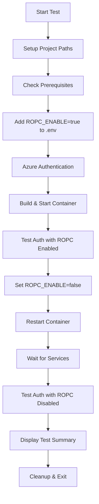

# ROPC (Resource Owner Password Credentials) Test Script

## Overview

The `test_enable_ropc.sh` script automates the testing of ROPC (Resource Owner Password Credentials) authentication by performing the following key actions:

1. **Backs up and modifies** the `.env` file to add `ROPC_ENABLE=true`
2. **Authenticates** with Azure Container Registry using the Azure CLI
3. **Builds and starts** the development container with ROPC enabled configuration
4. **Tests authentication** against `http://localhost/auth` with admin credentials
5. **Updates configuration** to `ROPC_ENABLE=false` and restarts the container
6. **Re-tests authentication** to verify ROPC can be properly disabled
7. **Generates a comprehensive test report** showing pass/fail status for each step
8. **Restores original configuration** and cleans up on completion

The script validates that ROPC authentication can be toggled on/off through environment variables and that the authentication endpoint responds appropriately to each configuration state.

## Purpose

This script follows TestRail test case requirements for validating ROPC authentication configuration, specifically testing:
- Environment variable management for ROPC settings
- Container deployment with different ROPC configurations
- Authentication endpoint behavior with ROPC enabled vs disabled
- Complete lifecycle testing from setup to cleanup

## Core Functionalities

### 1. **Environment Management**
- Backs up original `.env` file before modifications
- Adds/updates `ROPC_ENABLE` environment variable
- Restores original configuration on exit
- Cross-platform compatibility (macOS/Linux)

### 2. **Container Lifecycle Management**
- Azure Container Registry authentication
- Docker Compose container build and deployment
- Container health verification and monitoring
- Graceful container restart for configuration changes

### 3. **Authentication Testing**
- HTTP POST requests to `/auth` endpoint
- Response analysis (status codes and body content)
- Comparative testing between enabled/disabled states
- Comprehensive logging of authentication attempts

### 4. **Test Result Tracking**
- Individual test result recording with pass/fail status
- Comprehensive test summary with statistics
- Color-coded output for easy result identification
- Overall test status determination with appropriate exit codes

## Test Workflow



## Command Usage

### Basic Execution
```bash
cd /path/to/qa_test_automation
chmod +x test_enable_ropc.sh
./test_enable_ropc.sh
```

### Manual Authentication Testing
```bash
# Test ROPC enabled
curl --location 'http://localhost/auth' \
  --header 'Content-Type: application/x-www-form-urlencoded' \
  --data-urlencode 'user=admin' \
  --data-urlencode 'pass=_mywWorld_'

# Test ROPC disabled (after running script)
curl --location 'http://localhost/auth' \
  --header 'Content-Type: application/x-www-form-urlencoded' \
  --data-urlencode 'user=admin' \
  --data-urlencode 'pass=_mywWorld_'
```

### Container Management
```bash
# Check container status
docker ps | grep iqgeo_myproj

# View container logs
docker logs iqgeo_myproj

# Check environment variables in container
docker exec iqgeo_myproj bash -c 'echo "ROPC_ENABLE: $ROPC_ENABLE"'
```

## Success Scenarios

### ✅ **Test Passes When:**

1. **Environment Setup Succeeds**
   - `.env` file exists and is writable
   - Docker and Azure CLI are installed and accessible
   - All required files (docker-compose.yml) are present

2. **Container Operations Work**
   - Azure authentication succeeds
   - Container builds and starts without errors
   - Container restarts successfully with new configuration
   - Services initialize properly after restart

3. **Authentication Behaves Correctly**
   - ROPC enabled: Returns expected response (200 OK or configured behavior)
   - ROPC disabled: Returns 401 Unauthorized (authentication rejected)
   - Endpoint remains accessible in both states

4. **Configuration Management Works**
   - Environment variables persist in container
   - Configuration changes take effect after restart
   - Backup and restore operations succeed

## Failure Scenarios

### ❌ **Test Fails When:**

1. **Prerequisites Missing**
   ```
   Error: Docker not found
   Error: Azure CLI not found  
   Error: .env file not found
   ```

2. **Authentication Issues**
   ```
   Error: Azure authentication failed
   Solution: Run 'az login' or check Azure CLI configuration
   ```

3. **Container Problems**
   ```
   Error: Container build failed
   Solution: Check Docker daemon, image availability, network connectivity
   
   Error: Container not running after restart
   Solution: Check container logs, port conflicts, resource availability
   ```

4. **Network Connectivity Issues**
   ```
   Error: Failed to connect to authentication endpoint (Exit code 7)
   Solution: Verify container is running, check port bindings, wait longer
   ```

5. **Configuration Problems**
   ```
   Warning: ROPC_ENABLE not set in container
   Solution: Check environment variable passing, container restart
   
   Warning: Authentication still works with ROPC disabled
   Solution: Verify ROPC implementation, check configuration application
   ```

## Expected Outcomes

### **ROPC Enabled State**
- **HTTP 200**: Authentication successful - ROPC working correctly
- **HTTP 401**: Authentication failed - may indicate configuration issues
- **Connection Error**: Service not ready - requires investigation

### **ROPC Disabled State**  
- **HTTP 401**: Authentication rejected - CORRECT behavior (test passes)
- **HTTP 200**: Authentication still works - WARNING (potential issue)
- **Connection Error**: Service unavailable - test fails

## Test Output Example

```
=========================================================
                    TEST SUMMARY
=========================================================
✓ Environment Variable Addition: ROPC_ENABLE=true added to .env file
✓ Azure Authentication: Successfully authenticated with Azure Container Registry
✓ Container Startup: Container built and started successfully
✓ Container Restart: Container restarted successfully with ROPC_ENABLE=false
⚠ ROPC Enabled Authentication: HTTP 401 - Endpoint accessible but authentication failed
✓ ROPC Disabled Authentication: HTTP 401 - Authentication properly rejected when ROPC disabled

Test Results Summary:
  Passed: 5
  Failed: 0
  Warnings: 1
  Total Tests: 6

=========================================================
OVERALL TEST STATUS: PASSED WITH WARNINGS
=========================================================
```

## Troubleshooting Guide

### **Container Won't Start**
1. Check Docker daemon status: `docker info`
2. Verify image availability: `docker images`
3. Check port conflicts: `netstat -tulpn | grep :80`
4. Review container logs: `docker logs iqgeo_myproj`

### **Authentication Fails**
1. Verify container is running: `docker ps`
2. Check service logs: `docker exec iqgeo_myproj tail -f /var/log/apache2/error.log`
3. Test endpoint accessibility: `curl -I http://localhost/auth`
4. Verify environment variables: `docker exec iqgeo_myproj env | grep ROPC`

### **Azure Authentication Issues**
1. Login to Azure: `az login`
2. Check subscription: `az account show`
3. Verify registry access: `az acr login --name iqgeoproddev`

### **Script Hangs or Times Out**
1. Increase wait times in script (modify sleep values)
2. Check system resources: `docker stats`
3. Monitor container startup: `docker logs -f iqgeo_myproj`

## Dependencies

- **Docker**: Container management and deployment
- **Docker Compose**: Multi-container orchestration  
- **Azure CLI**: Container registry authentication
- **curl**: HTTP request testing
- **bash**: Script execution environment
- **sed/grep**: Text processing utilities

## Configuration Files

- **`.env`**: Environment variables for container configuration
- **`docker-compose.yml`**: Container deployment specification
- **`.env.backup`**: Automatic backup created during test execution

## Exit Codes

- **0**: All tests passed successfully
- **1**: One or more tests failed or critical errors occurred

## Notes

- Script creates automatic backups and performs cleanup on exit
- Supports both macOS and Linux environments
- Includes comprehensive error handling and user feedback
- Designed for both automated CI/CD and manual testing workflows