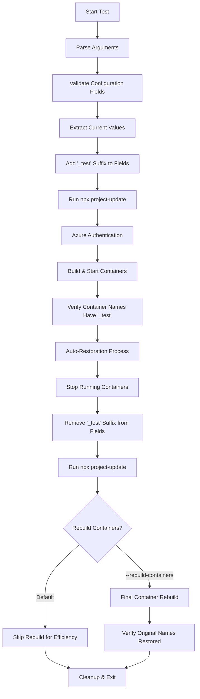

# Display Names Modification Test Script

## Overview

The `test_modify_display_names.sh` script automates the testing of display name modification functionality in the IQGeo Utils-Project-Template by performing the following key actions:

1. **Backs up the original** `.iqgeorc.jsonc` configuration file
2. **Validates configuration structure** ensuring required fields exist
3. **Adds '_test' suffix** to specific display name fields (name, display_name, prefix, db_name)
4. **Runs `npx project-update`** to apply configuration changes to the repository
5. **Authenticates with Azure** Container Registry for container access
6. **Builds and starts** the development environment with modified names
7. **Verifies container names** contain the '_test' suffix in the running environment
8. **Auto-restores original configuration** efficiently (skips rebuild by default)
9. **Optionally rebuilds containers** with original names (when explicitly requested)
10. **Generates comprehensive test reports** showing pass/fail status for each step

The script validates the complete display name modification workflow from configuration changes through container deployment verification, ensuring that display name modifications are properly reflected in the development environment.

## Purpose

This script provides automated quality assurance for the display name modification process, specifically testing:
- Configuration file field modification and validation
- Display name field parsing and suffix addition
- Project update integration with modified names
- Container deployment with changed display names
- Container name verification in running environment
- Configuration restoration and cleanup processes

## Core Functionalities

### 1. **Configuration Management**
- Automatic backup and restoration of `.iqgeorc.jsonc`
- Safe modification of JSON configuration with validation
- Field existence validation before modification
- Support for multiple display name fields simultaneously

### 2. **Display Name Field Processing**
- **name field**: Modified only on line 2 of configuration
- **display_name field**: Modified on any line where found
- **prefix field**: Modified on any line where found  
- **db_name field**: Modified on any line where found
- Duplicate suffix prevention (won't add '_test' if already present)

### 3. **Development Environment Integration**
- Azure Container Registry authentication
- Docker Compose container orchestration
- Project update execution and validation
- Container health monitoring and verification

### 4. **Container Name Verification**
- Runtime container name checking for '_test' suffix
- Container listing and name extraction
- Verification of modified names in running environment
- Post-restoration verification that '_test' suffix is removed

### 5. **Auto-Restoration Workflow**
- Automatic container stopping before restoration
- Configuration file restoration to original state
- Post-restoration project update execution
- **Efficient completion** (skips time-consuming container rebuild by default)
- Optional final container rebuild when explicitly requested with `--rebuild-containers`

## Test Workflow



## Command Usage

### Basic Display Name Testing
```bash
cd /path/to/qa_test_automation
chmod +x test_modify_display_names.sh

# Efficient workflow (default - no container rebuild)
./test_modify_display_names.sh

# Full workflow with container rebuild (slower)
./test_modify_display_names.sh --rebuild-containers
```

### Manual Operations
```bash
# Manual restore only (remove '_test' suffix)
./test_modify_display_names.sh --restore

# Add '_test' suffix without building environment
./test_modify_display_names.sh --skip-build

# Test without auto-restore (leaves '_test' suffix)
./test_modify_display_names.sh --no-auto-restore
```

### Advanced Options
```bash
# Skip project update (manual control)
./test_modify_display_names.sh --skip-update

# Use custom configuration file
./test_modify_display_names.sh --file /path/to/.iqgeorc.jsonc

# Force container rebuild (time-consuming)
./test_modify_display_names.sh --rebuild-containers

# View current configuration values
grep -E '"(name|display_name|prefix|db_name)"' ../.iqgeorc.jsonc
```

### Container and Name Inspection
```bash
# Check running containers and names
docker ps --format "table {{.Names}}\t{{.Image}}\t{{.Status}}"

# Verify container names contain '_test'
docker ps --format "{{.Names}}" | grep "_test"

# Check container logs
docker logs <container_name>

# Monitor container startup
docker compose -f .devcontainer/docker-compose.yml --profile iqgeo logs -f
```

## Success Scenarios

### ✅ **Test Passes When:**

1. **Configuration Operations Succeed**
   - `.iqgeorc.jsonc` file exists and is writable
   - Required fields (name, display_name, prefix, db_name) are present
   - '_test' suffix is successfully added to all target fields
   - JSON structure remains valid after modification

2. **Project Integration Works**
   - `npx project-update` executes without errors after modification
   - Configuration changes apply to repository correctly
   - No conflicts with modified display names
   - Docker Compose configuration updates properly

3. **Container Operations Complete**
   - Azure Container Registry authentication succeeds
   - Docker containers build and start successfully with modified names
   - All expected containers are running
   - Container names reflect '_test' suffix modification

4. **Name Verification Passes**
   - Running containers have names containing '_test' suffix
   - Container names match modified configuration values
   - No containers running with original names
   - All target containers successfully renamed

5. **Restoration Operations Work**
   - Automatic restoration removes '_test' suffix correctly
   - Original configuration values are properly restored
   - Post-restoration project-update completes successfully
   - **Efficient completion** without time-consuming container rebuild (default)
   - Optional container rebuild available with `--rebuild-containers` flag

## Failure Scenarios

### ❌ **Test Fails When:**

1. **Prerequisites Missing**
   ```
   Error: npx (Node.js) not found
   Error: docker not found  
   Error: az (Azure CLI) not found
   ```

2. **Configuration Issues**
   ```
   Error: .iqgeorc.jsonc not found
   Error: Required field 'name' not found in configuration
   Error: Required field 'display_name' not found in configuration
   Error: Failed to modify configuration file
   ```

3. **Project Update Problems**
   ```
   Error: npx project-update failed
   Error: Configuration validation failed
   Error: Docker Compose file generation failed
   ```

4. **Container Build Issues**
   ```
   Error: Azure authentication failed
   Error: Docker Compose build failed
   Error: Container startup timeout
   Error: No running containers found
   ```

5. **Name Verification Failures**
   ```
   Error: No containers found with '_test' suffix
   Error: Original container names still present
   Error: Container name modification not reflected
   ```

6. **Restoration Problems**
   ```
   Error: Failed to remove '_test' suffix
   Error: Restoration project-update failed
   Error: Final container rebuild failed
   Error: Original names not restored
   ```

## Configuration Fields Targeted

The script modifies the following fields in `.iqgeorc.jsonc`:

### **name** (Line 2 only)
- **Location**: Must be on line 2 of the configuration file
- **Modification**: Appends '_test' to existing value
- **Example**: `"myproject"` → `"myproject_test"`
- **Impact**: Affects container naming and project identification

### **display_name** (Any line)
- **Location**: Can be found anywhere in the configuration
- **Modification**: Appends '_test' to existing value  
- **Example**: `"My Project"` → `"My Project_test"`
- **Impact**: Affects UI display names and labels

### **prefix** (Any line)
- **Location**: Can be found anywhere in the configuration
- **Modification**: Appends '_test' to existing value
- **Example**: `"myproj"` → `"myproj_test"`
- **Impact**: Affects resource prefixes and naming conventions

### **db_name** (Any line)
- **Location**: Can be found anywhere in the configuration
- **Modification**: Appends '_test' to existing value
- **Example**: `"mydatabase"` → `"mydatabase_test"`
- **Impact**: Affects database naming and connections

## Container Name Verification

The script performs comprehensive container name verification:

### **During Testing Phase**
- Verifies all running containers have names containing '_test' suffix
- Checks that modified names are properly reflected in container environment
- Ensures no containers are running with original (unmodified) names
- Validates container startup with modified configuration

### **During Restoration Phase**  
- Verifies '_test' suffix has been removed from all container names
- Checks that original names are restored in running containers
- Ensures complete cleanup with no residual '_test' suffixes
- Validates final container environment matches original state

## Restoration Process

The auto-restoration workflow ensures clean test completion:

1. **Container Cleanup**
   - Stops all running containers gracefully
   - Removes containers to prevent naming conflicts
   - Clears Docker Compose state

2. **Configuration Restoration**
   - Removes '_test' suffix from all modified fields
   - Restores original field values exactly
   - Validates configuration file integrity

3. **Repository Update** (Always performed)
   - Runs `npx project-update` with restored configuration
   - Updates all project files with original configuration
   - Ensures clean repository state

4. **Container Rebuild** (Optional - use `--rebuild-containers`)
   - Rebuilds containers with original names when requested
   - Verifies final environment matches original state
   - **Skipped by default** to save time and improve efficiency

## Known Limitations

1. **Line-Specific Processing**: The 'name' field is only modified if found on line 2 of the configuration file
2. **Suffix Duplication Prevention**: Won't add '_test' if the suffix already exists, preventing double modification
3. **Field Dependency**: All target fields (name, display_name, prefix, db_name) must exist in the configuration
4. **Container State After Restoration**: By default, containers may retain '_test' names after restoration (use `--rebuild-containers` for full cleanup)
5. **Container Rebuild Time**: Optional container rebuild can take 2-5 minutes when using `--rebuild-containers`
6. **Azure Authentication**: Requires valid Azure CLI authentication and access to iqgeoproddev registry

## Error Handling

The script includes comprehensive error handling for:
- Missing or invalid configuration files
- Field existence validation before modification
- Project update execution failures
- Container build and startup issues
- Azure authentication problems
- Restoration operation failures
- Container name verification failures

All errors are clearly reported with specific error messages and suggested remediation steps.

## Efficiency Improvements

**New Default Behavior**: The script now **skips container rebuild by default** to significantly improve execution time while maintaining full testing functionality.

### **Fast Workflow (Default)**
- ✅ Tests configuration modification and restoration
- ✅ Validates project update integration
- ✅ Verifies container deployment with '_test' names
- ✅ Restores configuration to original state
- ⚡ **Skips time-consuming container rebuild** (saves 2-5 minutes)
- 📋 Note: Containers may retain '_test' names until next rebuild

### **Complete Workflow** (use `--rebuild-containers`)
- ✅ All fast workflow benefits
- ✅ **Additional**: Rebuilds containers with original names
- 🕐 Takes longer but ensures complete environment reset

## Best Practices

1. **Pre-Test Verification**: Ensure `.iqgeorc.jsonc` contains all required fields before running
2. **Azure Authentication**: Verify Azure CLI login status before executing
3. **Container State**: Check no conflicting containers are running before test execution
4. **Backup Safety**: The script creates automatic backups but manual backups are recommended for production systems
5. **Network Connectivity**: Ensure stable internet connection for Azure registry and npm operations
6. **Resource Monitoring**: Monitor system resources during container rebuild operations
7. **Log Review**: Check container logs if verification steps fail to identify specific issues

## Troubleshooting

### **Common Issues and Solutions**

1. **Field Not Found Errors**
   ```bash
   # Check configuration structure
   grep -n -E '"(name|display_name|prefix|db_name)"' ../.iqgeorc.jsonc
   ```

2. **Container Name Verification Failures**
   ```bash
   # Check running containers
   docker ps --format "{{.Names}}"
   
   # Verify container naming pattern
   docker ps --format "{{.Names}}" | grep -E "(test|_test)"
   ```

3. **Restoration Issues**
   ```bash
   # Manual restoration if auto-restore fails
   ./test_modify_display_names.sh --restore
   
   # Force container cleanup
   docker compose -f .devcontainer/docker-compose.yml --profile iqgeo down --remove-orphans
   ```

4. **Azure Authentication Problems**
   ```bash
   # Re-authenticate with Azure
   az login
   az acr login --name iqgeoproddev
   ```

The `test_modify_display_names.sh` script provides comprehensive testing of display name modification functionality, ensuring that configuration changes are properly reflected in the development environment while maintaining clean state management through automatic restoration processes.