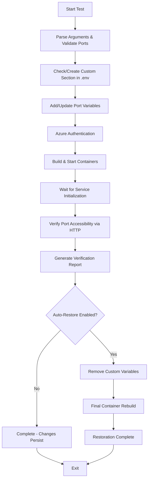

# Port Modification Test Script

## Overview

The `test_modify_ports.sh` script automates the testing of environment variable port configuration in the IQGeo Utils-Project-Template by performing the following key actions:

1. **Backs up the original** `.env` file state by tracking custom variables
2. **Validates port parameters** ensuring proper variable name and port number format
3. **Creates custom section** in `.env` file if it doesn't exist for organized variable management
4. **Adds/updates port variables** with `_PORT` suffix in the designated custom section
5. **Authenticates with Azure** Container Registry for container access
6. **Builds and starts** the development environment with modified port configuration
7. **Verifies port accessibility** via HTTP requests to confirm services are running on specified ports
8. **Auto-restores original configuration** by removing custom variables and rebuilding containers
9. **Generates comprehensive test reports** showing pass/fail status for each verification step

The script validates the complete port modification workflow from environment configuration through accessibility verification, ensuring port changes are properly applied and accessible in the running development environment.

## Purpose

This script provides automated quality assurance for port configuration management, specifically testing:
- Environment variable modification and custom section management
- Port number validation and variable naming conventions
- Container deployment with modified port configurations
- Port accessibility verification via HTTP endpoint testing
- Configuration restoration and cleanup processes
- Complete workflow from modification to verification to restoration

## Core Functionalities

### 1. **Environment Configuration Management**
- Automatic custom section creation and management in `.env` file
- Safe modification of environment variables with organized structure
- Variable tracking system for restoration purposes
- Support for multiple port variables in single operation

### 2. **Port Variable Processing**
- **Variable Naming**: Automatic `_PORT` suffix addition to variable names
- **Format Validation**: Ensures uppercase letters, numbers, and underscores only
- **Port Range Validation**: Validates port numbers within range 1-65535
- **Duplicate Handling**: Updates existing variables or adds new ones as needed

### 3. **Custom Section Management**
- **Section Markers**: Uses `# START CUSTOM SECTION` and `# END CUSTOM SECTION`
- **Organized Structure**: Keeps custom variables separate from default configuration
- **Automatic Creation**: Creates custom section if it doesn't exist
- **Clean Removal**: Removes only custom variables during restoration

### 4. **Development Environment Integration**
- Azure Container Registry authentication for container access
- Docker Compose container orchestration with updated environment
- Container health monitoring and service startup verification
- Complete rebuild process for configuration application

### 5. **Port Accessibility Verification**
- HTTP endpoint testing via curl for each configured port
- Special handling for APP_PORT with `/index` path appending
- Extended wait times for service initialization (especially APP service)
- Comprehensive response code analysis and reporting

### 6. **Auto-Restoration Workflow**
- Automatic removal of custom variables after testing
- Configuration restoration to original state
- Optional final container rebuild for complete cleanup
- Success tracking and comprehensive result reporting

## Test Workflow



## Command Usage

### Basic Port Modification
```bash
cd /path/to/qa_test_automation
chmod +x test_modify_ports.sh

# Single port variable
./test_modify_ports.sh APP 8080

# Multiple port variables
./test_modify_ports.sh KEYCLOAK 8081 PGADMIN 8091
./test_modify_ports.sh POSTGIS 5433 REDIS 6380 ELASTIC 9200
```

### Advanced Configuration
```bash
# Database and service ports
./test_modify_ports.sh POSTGIS 5433 PGADMIN 8091 REDIS 6380

# Application and authentication ports
./test_modify_ports.sh APP 8080 KEYCLOAK 8081 AUTH 8082

# Custom file path
./test_modify_ports.sh --file /custom/path/.env APP 8080
```

### Management Operations
```bash
# Show current custom variables
./test_modify_ports.sh --current

# Remove all custom variables manually
./test_modify_ports.sh --remove

# Check current configuration
./test_modify_ports.sh --current
# Example output:
# Current custom environment variables:
#   1. APP_PORT=8080
#   2. KEYCLOAK_PORT=8081
```

### Workflow Control Options
```bash
# Skip building containers (configuration only)
./test_modify_ports.sh --skip-build APP 8080

# Skip port verification (build without testing accessibility)
./test_modify_ports.sh --skip-verify KEYCLOAK 8081

# Skip automatic restoration (changes persist)
./test_modify_ports.sh --no-auto-restore APP 8080

# Restore configuration but skip final rebuild
./test_modify_ports.sh --skip-final-rebuild PGADMIN 8091
```

### Verification and Testing
```bash
# Manual port testing after script execution
curl -s -w '%{http_code}' 'http://localhost:8080/index'  # For APP_PORT
curl -s -w '%{http_code}' 'http://localhost:8081'       # For KEYCLOAK_PORT

# Check running containers and port mappings
docker ps --format "table {{.Names}}\t{{.Ports}}"

# Verify environment variables in containers
docker exec -t <container_name> env | grep _PORT
```

## Success Scenarios

### ✅ **Test Passes When:**

1. **Configuration Operations Succeed**
   - `.env` file exists and is writable
   - Variable names contain only valid characters (uppercase, numbers, underscores)
   - Port numbers are within valid range (1-65535)
   - Custom section is created/updated successfully

2. **Environment Variable Management Works**
   - Variables are added with proper `_PORT` suffix format
   - Custom section markers are properly maintained
   - Multiple variables can be processed in single operation
   - Existing variables are updated correctly when specified again

3. **Container Operations Complete**
   - Azure Container Registry authentication succeeds
   - Docker containers build and start successfully with updated configuration
   - All expected containers are running with new port mappings
   - Services initialize within expected timeframes

4. **Port Accessibility Verification Passes**
   - HTTP requests to specified ports return successful response codes (200, 302, etc.)
   - Services respond on configured ports within timeout periods
   - APP_PORT responds correctly to `/index` endpoint
   - All or majority of configured ports are accessible

5. **Auto-Restoration Operations Work**
   - Custom variables are successfully removed from `.env` file
   - Original configuration state is restored
   - Final container rebuild completes successfully (unless skipped)
   - Environment returns to original state with no custom variables

## Failure Scenarios

### ❌ **Test Fails When:**

1. **Prerequisites Missing**
   ```
   Error: .env file not found
   Error: docker not found
   Error: az (Azure CLI) not found
   Error: curl not found (for port verification)
   ```

2. **Parameter Validation Issues**
   ```
   Error: Variable name 'invalid-name' contains invalid characters
   Error: Port value '99999' is out of valid range (1-65535)
   Error: Port value 'abc' is not a valid number
   Error: Variable name and port value must be provided in pairs
   ```

3. **Configuration File Problems**
   ```
   Error: .env file not found
   Error: Failed to create custom section in .env file
   Error: Failed to add environment variables
   Error: File permissions prevent modification
   ```

4. **Container Build Issues**
   ```
   Error: Azure authentication failed
   Error: Development environment build failed
   Error: Container startup timeout
   Error: No containers running after build
   ```

5. **Port Verification Failures**
   ```
   Error: Port 8080 is not accessible - Connection refused
   Error: curl command failed with exit code 7
   Error: HTTP response code 404 - Service not ready
   Error: All port verification attempts failed
   ```

6. **Restoration Problems**
   ```
   Error: Failed to remove custom variables
   Error: Auto-restoration failed during final rebuild
   Error: Custom variables still present after restoration
   ```

## Environment Variable Format

### Variable Naming Convention
The script automatically formats variables with the `_PORT` suffix:

```bash
# Input format:
./test_modify_ports.sh APP 8080 KEYCLOAK 8081

# Results in .env file:
APP_PORT=8080
KEYCLOAK_PORT=8081
```

### Custom Section Structure
Variables are organized within designated markers in the `.env` file:

```bash
# Existing .env content above...

# START CUSTOM SECTION
APP_PORT=8080
KEYCLOAK_PORT=8081
PGADMIN_PORT=8091
POSTGIS_PORT=5433
# END CUSTOM SECTION

# Existing .env content below...
```

### Variable Name Requirements
- **Format**: Uppercase letters, numbers, and underscores only
- **Pattern**: `^[A-Z0-9_]+$`
- **Examples**: 
  - ✅ Valid: `APP`, `KEYCLOAK`, `POSTGIS`, `REDIS_CACHE`, `AUTH_SERVICE`
  - ❌ Invalid: `app`, `key-cloak`, `postgis.db`, `123invalid`

### Port Number Requirements
- **Range**: 1-65535 (valid TCP/UDP port range)
- **Format**: Numeric values only
- **Examples**:
  - ✅ Valid: `8080`, `3000`, `5432`, `6379`
  - ❌ Invalid: `abc`, `80.5`, `-1`, `99999`

## Port Verification Details

### HTTP Accessibility Testing
The script verifies port accessibility through HTTP requests:

#### Standard Port Verification
```bash
# Standard format for most services
curl -s -w '%{http_code}' 'http://localhost:PORT_NUMBER'
```

#### Special APP_PORT Handling
```bash
# APP_PORT gets special treatment with /index path
curl -s -w '%{http_code}' 'http://localhost:8080/index'

# Includes extended wait time (90 seconds) for APP service initialization
```

### Response Code Interpretation
- **2xx codes (200, 201, 202, etc.)**: Success - service accessible
- **3xx codes (301, 302, 304, etc.)**: Success - redirects indicate service is responding
- **4xx codes (401, 403, 404, etc.)**: Partial success - service responding but may need authentication/configuration
- **5xx codes (500, 502, 503, etc.)**: Failure - service error or not ready
- **Connection refused/timeout**: Failure - service not accessible on specified port

### Verification Timing
- **Initial wait**: 10 seconds for general service readiness
- **APP_PORT additional wait**: 90 seconds for application initialization
- **Retry logic**: No automatic retries (single attempt per port)
- **Timeout**: Curl default timeout (no explicit timeout set)

## Auto-Restoration Process

### Restoration Workflow
The auto-restoration ensures clean test completion:

1. **Variable Removal**
   - Identifies and removes all custom variables from the custom section
   - Preserves custom section markers for future use
   - Maintains original `.env` file structure

2. **Verification**
   - Displays current variables after removal (should show empty custom section)
   - Confirms successful variable cleanup
   - Validates file integrity

3. **Container Rebuild** (unless skipped)
   - Rebuilds containers with original configuration
   - Ensures all services return to original port mappings
   - Verifies successful container startup

4. **Cleanup Completion**
   - Reports successful restoration
   - Confirms environment returned to original state
   - Provides summary of changes made and reverted

### Restoration Control Options
```bash
# Default: Full restoration with container rebuild
./test_modify_ports.sh APP 8080

# Skip automatic restoration (changes persist)
./test_modify_ports.sh --no-auto-restore APP 8080

# Restore configuration but skip final rebuild
./test_modify_ports.sh --skip-final-rebuild APP 8080

# Manual restoration anytime
./test_modify_ports.sh --remove
```

## Best Practices

1. **Pre-Test Verification**: Check current variables with `--current` before making changes
2. **Port Selection**: Use non-standard ports to avoid conflicts (avoid 80, 443, 22, etc.)
3. **Variable Naming**: Use descriptive, uppercase names following the established convention
4. **Azure Authentication**: Verify Azure CLI login status before executing
5. **Container State**: Ensure no conflicting containers are running before test execution
6. **Network Ports**: Verify selected ports are not in use by other services on the host
7. **Service Dependencies**: Consider service startup order and dependencies for verification timing

## Troubleshooting

### Common Issues and Solutions

1. **Port Already in Use Errors**
   ```bash
   # Check what's using a port
   lsof -i :8080
   netstat -tlnp | grep :8080
   
   # Use different ports
   ./test_modify_ports.sh APP 8081 KEYCLOAK 8082
   ```

2. **Variable Format Issues**
   ```bash
   # Incorrect format (will fail)
   ./test_modify_ports.sh app 8080        # lowercase not allowed
   ./test_modify_ports.sh key-cloak 8081  # hyphens not allowed
   
   # Correct format
   ./test_modify_ports.sh APP 8080        # ✓ Valid
   ./test_modify_ports.sh KEYCLOAK 8081   # ✓ Valid
   ```

3. **Port Verification Failures**
   ```bash
   # Check container status and port mappings
   docker ps --format "table {{.Names}}\t{{.Ports}}\t{{.Status}}"
   
   # Check container logs for startup issues
   docker logs <container_name>
   
   # Manual port testing
   curl -v http://localhost:8080/index  # For detailed curl output
   ```

4. **Service Initialization Issues**
   ```bash
   # Some services need more time - check logs
   docker logs -f <container_name>
   
   # Wait longer and test manually
   sleep 60
   curl -s -w '%{http_code}' 'http://localhost:8080/index'
   ```

5. **Custom Section Problems**
   ```bash
   # Check .env file structure
   grep -n "CUSTOM SECTION" ../.devcontainer/.env
   
   # Manually verify custom section exists
   cat ../.devcontainer/.env | sed -n '/# START CUSTOM SECTION/,/# END CUSTOM SECTION/p'
   ```

6. **Azure Authentication Problems**
   ```bash
   # Re-authenticate with Azure
   az login
   az acr login --name iqgeoproddev
   ```

### Error Recovery Procedures

1. **Configuration Corruption**
   - Use `--remove` to clear custom variables
   - Manually edit `.env` file if custom section is malformed
   - Restore from backup if available

2. **Container Build Failures**
   - Check Azure authentication status
   - Verify Docker Compose file syntax
   - Review container logs for specific errors

3. **Port Conflicts**
   - Use `--remove` to clear conflicting port assignments
   - Check system port usage before assigning ports
   - Restart Docker daemon if persistent port conflicts occur

4. **Restoration Failures**
   - Manually run `--remove` command
   - Edit `.env` file directly to remove custom variables
   - Use `--skip-build` to avoid container rebuild issues

The `test_modify_ports.sh` script provides comprehensive testing of environment variable port configuration, ensuring port changes are properly applied, accessible, and can be cleanly restored while maintaining robust error handling and verification capabilities.