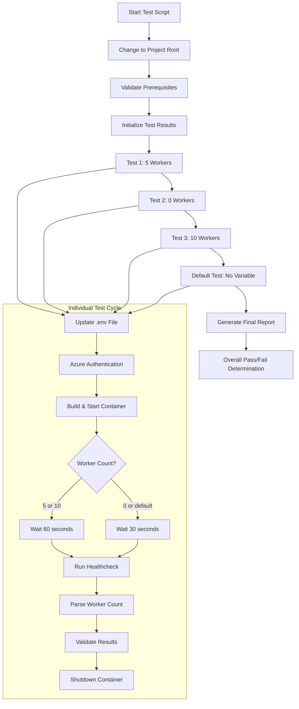

# MYW Task Workers Test Script

## Overview

The `test_myw_task_workers.sh` script automates the testing of MYW_TASK_WORKERS environment variable functionality in the IQGeo Utils-Project-Template by performing the following key actions:

1. **Modifies .env configuration** by adding/removing MYW_TASK_WORKERS variable
2. **Validates environment variable** insertion and removal in the devcontainer configuration
3. **Authenticates with Azure** Container Registry for container access
4. **Builds and starts** the development environment with specified worker configurations
5. **Executes healthcheck commands** inside containers to verify worker count
6. **Verifies worker initialization** through dynamic wait times based on worker count
7. **Parses healthcheck output** to extract and validate actual worker counts
8. **Tests multiple scenarios** (0, 5, 10 workers, and default configuration)
9. **Provides comprehensive reporting** showing pass/fail status for each test scenario

The script validates that the MYW_TASK_WORKERS environment variable properly controls the number of active task workers in the running development environment across different configuration scenarios.

## Purpose

This script provides automated quality assurance for MYW task worker configuration management, specifically testing:
- Environment variable modification and persistence in container environments
- Task worker initialization and startup timing across different worker counts
- Healthcheck command execution and output parsing for worker verification
- Container deployment with varying worker configurations
- Default behavior when no MYW_TASK_WORKERS variable is specified
- Complete workflow from configuration modification to worker verification

## Core Functionalities

### 1. **Environment Variable Management**
- Dynamic insertion of MYW_TASK_WORKERS variable into `.env` file
- Strategic placement after RQ_DASHBOARD_PORT for proper configuration order
- Complete removal of variable for default testing scenarios
- Cross-platform compatibility (macOS and Linux sed syntax support)

### 2. **Worker Count Configuration Testing**
- **Test 1**: 5 workers - moderate worker load testing
- **Test 2**: 0 workers - explicit zero worker configuration
- **Test 3**: 10 workers - high worker load testing  
- **Default Test**: No variable - system default behavior verification

### 3. **Dynamic Container Initialization**
- **Adaptive wait times**: 30 seconds default, 60 seconds for worker scenarios
- **Worker count detection**: Automatic timing adjustment based on expected workers
- **Environment verification**: Confirms MYW_TASK_WORKERS value inside containers
- **Container health monitoring**: Ensures containers are running before healthcheck

### 4. **Healthcheck Execution and Verification**
- **Interactive container access**: Simulates `docker exec -it` commands
- **Multiple command discovery**: Searches various paths for myw_task command
- **Comprehensive output parsing**: Multiple strategies for worker count extraction
- **Robust error handling**: Graceful handling of command not found scenarios

### 5. **Worker Count Parsing and Validation**
- **Pattern matching strategies**: "workers: X", "X workers", "X active" patterns
- **Flexible number extraction**: Multiple parsing approaches for different output formats
- **Validation logic**: Compares actual vs expected worker counts
- **Manual verification fallback**: Passes tests when parsing fails but command succeeds

### 6. **Test Result Tracking and Reporting**
- **Individual test tracking**: Pass/fail status for each of 4 test scenarios
- **Comprehensive summary**: Color-coded final results with detailed breakdown
- **Error categorization**: Specific failure reasons (Azure auth, build, healthcheck, etc.)
- **Overall status determination**: All tests must pass for overall success

## Test Workflow



## Command Usage

### Basic Test Execution
```bash
cd /path/to/qa_test_automation
chmod +x test_myw_task_workers.sh

# Run complete test suite (all 4 scenarios)
./test_myw_task_workers.sh

# This executes:
# - Test 1: MYW_TASK_WORKERS=5 (60-second wait)
# - Test 2: MYW_TASK_WORKERS=0 (30-second wait)  
# - Test 3: MYW_TASK_WORKERS=10 (60-second wait)
# - Default Test: No variable (30-second wait)
```

### Manual Environment Inspection
```bash
# Check current MYW_TASK_WORKERS setting in .env
grep "MYW_TASK_WORKERS" .devcontainer/.env

# Verify environment variable in running container
docker exec -it iqgeo_myproj bash -c 'echo $MYW_TASK_WORKERS'

# Manual healthcheck execution
docker exec -it iqgeo_myproj bash
myw_task healthcheck
```

### Container and Worker Verification
```bash
# Check running containers
docker ps --format "table {{.Names}}\t{{.Status}}\t{{.Ports}}"

# View container logs for worker-related messages
docker logs iqgeo_myproj | grep -i worker

# Monitor container startup and worker initialization
docker logs -f iqgeo_myproj
```

### Environment File Management
```bash
# View current .env file configuration
cat .devcontainer/.env | grep -A5 -B5 MYW_TASK_WORKERS

# Backup .env before testing
cp .devcontainer/.env .devcontainer/.env.backup

# Restore .env after testing (if needed)
cp .devcontainer/.env.backup .devcontainer/.env
```

## Success Scenarios

### ✅ **Test Passes When:**

1. **Environment Variable Operations Succeed**
   - `.env` file exists and is writable in `.devcontainer` directory
   - MYW_TASK_WORKERS variable is successfully inserted/removed
   - Variable placement occurs in correct location (after RQ_DASHBOARD_PORT)
   - Cross-platform sed operations complete without errors

2. **Azure Authentication Works**
   - Azure CLI is installed and accessible
   - User has valid authentication credentials
   - iqgeoproddev container registry login succeeds
   - Authentication persists throughout test execution

3. **Container Operations Complete**
   - Docker Compose build succeeds with updated configuration
   - Containers start successfully and remain running
   - Environment variables are properly passed to container environment
   - Container health stabilizes within wait periods

4. **Worker Initialization Succeeds**
   - Workers start within allocated time periods (30-60 seconds)
   - MYW_TASK_WORKERS environment variable is properly read by application
   - Healthcheck command executes successfully inside container
   - Worker count matches expected configuration

5. **Healthcheck and Parsing Work**
   - myw_task command is found and executable inside container
   - Healthcheck output contains parseable worker count information
   - Output parsing successfully extracts actual worker numbers
   - Actual worker count matches expected worker count for each test

6. **Test Execution Completes**
   - All 4 test scenarios complete without errors
   - Container shutdown and cleanup complete successfully
   - Test results are accurately tracked and reported
   - Overall test suite returns success status

## Failure Scenarios

### ❌ **Test Fails When:**

1. **Prerequisites Missing**
   ```
   Error: Environment file .devcontainer/.env not found
   Error: Docker compose file .devcontainer/docker-compose.yml not found
   Error: Docker not found. Please install Docker first.
   Error: Azure CLI not found. Please install Azure CLI first.
   ```

2. **Environment Variable Issues**
   ```
   Error: Failed to update .env file with MYW_TASK_WORKERS
   Error: RQ_DASHBOARD_PORT reference not found for variable insertion
   Error: Could not remove MYW_TASK_WORKERS from .env file
   Error: sed operation failed (permission or syntax issues)
   ```

3. **Azure Authentication Problems**
   ```
   Error: Azure authentication failed
   Error: az acr login --name iqgeoproddev failed
   Error: User not logged into Azure CLI
   Error: Insufficient permissions for iqgeoproddev registry
   ```

4. **Container Build/Start Issues**
   ```
   Error: Container build and start failed
   Error: Docker compose build failed with exit code X
   Error: Container iqgeo_myproj is not running
   Error: Container startup timeout or health check failure
   ```

5. **Healthcheck Command Problems**
   ```
   Error: myw_task command not found in container
   Error: Healthcheck command failed with exit code 127
   Error: Container environment not properly configured
   Error: Command discovery failed in all search paths
   ```

6. **Worker Count Verification Failures**
   ```
   Error: Healthcheck failed: X workers running (expected: Y)
   Error: Could not parse worker count from healthcheck output
   Error: Workers need more time to start up
   Error: Environment variable not properly read by application
   ```

7. **Container Shutdown Problems**
   ```
   Error: Container shutdown failed
   Error: Docker compose down operation failed
   Error: Containers remain running after shutdown attempt
   ```

## Worker Count Test Scenarios

### Test Scenario Details

#### **Test 1: 5 Workers**
- **Configuration**: `MYW_TASK_WORKERS=5`
- **Wait Time**: 60 seconds (extended for worker initialization)
- **Expected Outcome**: 5 active task workers detected by healthcheck
- **Purpose**: Tests moderate worker load configuration

#### **Test 2: 0 Workers** 
- **Configuration**: `MYW_TASK_WORKERS=0`
- **Wait Time**: 30 seconds (standard - no workers to initialize)
- **Expected Outcome**: 0 active task workers detected by healthcheck
- **Purpose**: Tests explicit zero-worker configuration

#### **Test 3: 10 Workers**
- **Configuration**: `MYW_TASK_WORKERS=10`
- **Wait Time**: 60 seconds (extended for worker initialization)
- **Expected Outcome**: 10 active task workers detected by healthcheck
- **Purpose**: Tests high worker load configuration

#### **Default Test: No Variable**
- **Configuration**: No MYW_TASK_WORKERS variable present
- **Wait Time**: 30 seconds (standard - system default behavior)
- **Expected Outcome**: 0 active task workers (system default)
- **Purpose**: Tests system behavior without explicit configuration

### Wait Time Strategy

The script uses adaptive wait times based on worker count requirements:

| Scenario | Worker Count | Wait Time | Reasoning |
|----------|-------------|-----------|-----------|
| Test 1 | 5 workers | 60 seconds | Extended time for 5 workers to initialize |
| Test 2 | 0 workers | 30 seconds | No workers to start, standard wait |
| Test 3 | 10 workers | 60 seconds | Extended time for 10 workers to initialize |
| Default | 0 workers | 30 seconds | System default, no workers expected |

## Healthcheck Command Discovery

### Command Search Strategy
The script searches for the `myw_task` command in multiple locations:

1. **PATH-based discovery**: `command -v myw_task`
2. **Standard binary location**: `/usr/local/bin/myw_task`
3. **Application directory**: `/opt/iqgeo/platform/WebApps/myworldapp/myw_task`
4. **Fallback search**: `find` operations in `/opt` and `/usr` directories

### Output Parsing Methods
The script uses multiple strategies to extract worker count from healthcheck output:

1. **Pattern 1**: "workers: X" or "Workers: X" format
2. **Pattern 2**: "X workers" or "X active" format  
3. **Pattern 3**: Any numeric value in output (fallback)

### Error Handling Approach
- **Command not found**: Provides detailed search information and exits gracefully
- **Parse failure**: Marks test as passed with manual verification note
- **Output ambiguity**: Displays full output for manual analysis

## Environment File Configuration

### Variable Insertion Strategy
The script inserts MYW_TASK_WORKERS using a hierarchical approach:

1. **Primary location**: After RQ_DASHBOARD_PORT line
2. **Secondary location**: Before START CUSTOM SECTION
3. **Fallback location**: Append to end of file

### Cross-Platform Compatibility
The script handles different operating systems:

```bash
# macOS sed syntax
sed -i '' '/pattern/action' file

# Linux sed syntax  
sed -i '/pattern/action' file
```

### Configuration Persistence
- Variables are inserted in appropriate configuration context
- Removal completely eliminates variable from file
- Original file structure and formatting preserved

## Best Practices

1. **Pre-Test Verification**: Ensure Docker daemon is running and Azure CLI is authenticated
2. **Environment Backup**: Consider backing up `.env` file before running tests
3. **Container State**: Verify no conflicting containers are running before test execution
4. **Resource Monitoring**: Monitor system resources during high worker count tests (Test 3)
5. **Log Analysis**: Review container logs if healthcheck failures occur
6. **Network Connectivity**: Ensure stable connection for Azure registry operations
7. **Timing Considerations**: Allow adequate time for worker initialization in production environments

## Troubleshooting

### Common Issues and Solutions

1. **Container Build Failures**
   ```bash
   # Check Docker daemon status
   docker info
   
   # Verify Azure authentication
   az acr login --name iqgeoproddev
   
   # Manual container build
   cd /path/to/project/root
   docker compose -f .devcontainer/docker-compose.yml --profile iqgeo up -d --build
   ```

2. **Healthcheck Command Not Found**
   ```bash
   # Manual container access
   docker exec -it iqgeo_myproj bash
   
   # Search for myw_task command
   find /opt -name "*myw*" -type f
   find /usr -name "*myw*" -type f
   which myw_task
   ```

3. **Worker Count Parsing Issues**
   ```bash
   # Manual healthcheck execution
   docker exec -it iqgeo_myproj bash
   myw_task healthcheck
   
   # Check for alternative commands
   compgen -c | grep -i task
   compgen -c | grep -i worker
   ```

4. **Environment Variable Problems**
   ```bash
   # Verify .env file content
   cat .devcontainer/.env | grep MYW_TASK_WORKERS
   
   # Check variable in container
   docker exec -it iqgeo_myproj bash -c 'env | grep MYW'
   
   # Manual variable verification
   docker exec -it iqgeo_myproj bash -c 'echo $MYW_TASK_WORKERS'
   ```

5. **Azure Authentication Issues**
   ```bash
   # Re-authenticate with Azure
   az login
   az acr login --name iqgeoproddev
   
   # Verify authentication status
   az account show
   ```

### Error Recovery Procedures

1. **Environment File Corruption**
   - Restore from backup: `cp .devcontainer/.env.backup .devcontainer/.env`
   - Manually remove MYW_TASK_WORKERS lines if needed
   - Verify file syntax and formatting

2. **Container State Issues**
   - Force container cleanup: `docker compose -f .devcontainer/docker-compose.yml --profile iqgeo down --remove-orphans`
   - Remove dangling containers: `docker container prune`
   - Clear build cache if needed: `docker builder prune`

3. **Test Script Interruption**
   - The cleanup trap function automatically attempts container shutdown
   - Manual cleanup: `docker compose -f .devcontainer/docker-compose.yml --profile iqgeo down`
   - Check for remaining MYW_TASK_WORKERS in .env file

The `test_myw_task_workers.sh` script provides comprehensive testing of MYW task worker configuration, ensuring that the MYW_TASK_WORKERS environment variable properly controls worker initialization across different scenarios while maintaining robust error handling and verification capabilities.