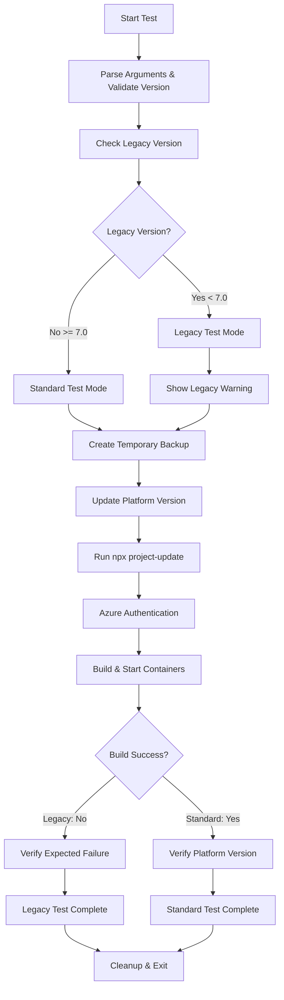

# Platform Version Update Test Script

## Overview

The `test_update_platform_version.sh` script automates the testing of platform version update functionality in the IQGeo Utils-Project-Template by performing the following key actions:

1. **Backs up the original** `.iqgeorc.jsonc` configuration file with temporary backup system
2. **Validates version format** ensuring proper semantic versioning (e.g., 7.4, 8.0)
3. **Updates platform version** on line 11 of the configuration file
4. **Runs `npx project-update`** to apply version changes to the repository
5. **Authenticates with Azure** Container Registry for container access
6. **Builds and starts** the development environment with updated platform version
7. **Verifies platform version** in the running container environment
8. **Handles legacy versions** (< 7.0) with expected build failure testing
9. **Provides temporary backup restoration** for rollback scenarios
10. **Generates comprehensive test reports** showing pass/fail status for each step

The script validates the complete platform version update workflow from configuration changes through container deployment verification, ensuring platform version updates are properly reflected in the development environment.

## Purpose

This script provides automated quality assurance for platform version management, specifically testing:
- Configuration file version field modification and validation
- Platform version format validation and compatibility checking
- Project update integration with version changes
- Container deployment with updated platform version
- Platform version verification in running environment
- Legacy version compatibility and rejection testing
- Configuration restoration and rollback processes

## Core Functionalities

### 1. **Configuration Management**
- Temporary backup and restoration system for `.iqgeorc.jsonc`
- Precise line-based modification (line 11) of version field
- Version format validation (semantic versioning support)
- Current version extraction and comparison

### 2. **Platform Version Processing**
- **Version Field Targeting**: Specifically modifies version on line 11
- **Format Validation**: Ensures proper semantic version format (X.Y or X.Y.Z)
- **Legacy Detection**: Identifies versions < 7.0 as unsupported legacy versions
- **Compatibility Checking**: Validates version compatibility before deployment

### 3. **Development Environment Integration**
- Azure Container Registry authentication for version-specific containers
- Docker Compose container orchestration with updated platform
- Project update execution and version propagation
- Container health monitoring and startup verification

### 4. **Platform Version Verification**
- Runtime version checking in containers via `/opt/iqgeo/platform/WebApps/myworldapp/core/version_info.json`
- Version extraction from JSON configuration files
- Major.minor version matching with patch version tolerance
- Comprehensive verification reporting with detailed output

### 5. **Legacy Version Testing**
- Automatic detection of legacy versions (< 7.0)
- Expected build failure testing for unsupported versions
- Legacy compatibility verification workflow
- Proper rejection validation for outdated platform versions

### 6. **Temporary Backup System**
- Automatic temporary file creation for rollback scenarios
- Restoration workflow with automatic project-update execution
- Cleanup procedures for temporary files
- Manual restoration capability via `--restore` flag

## Test Workflow



## Command Usage

### Basic Platform Version Updates
```bash
cd /path/to/qa_test_automation
chmod +x test_update_platform_version.sh

# Update to specific platform version
./test_update_platform_version.sh 7.5
./test_update_platform_version.sh 8.0
./test_update_platform_version.sh 7.4.2

# Update with build and verification
./test_update_platform_version.sh 7.5  # Full workflow with container verification
```

### Version Information
```bash
# Show current platform version
./test_update_platform_version.sh --current

# Example output:
# [INFO] Current platform version: 7.4
```

### Advanced Options
```bash
# Update version without building containers
./test_update_platform_version.sh 8.0 --skip-build

# Update and build but skip version verification
./test_update_platform_version.sh 7.5 --skip-verify

# Update without running project-update
./test_update_platform_version.sh 7.4 --skip-update

# Use custom configuration file
./test_update_platform_version.sh --file ./custom.jsonc 7.5
```

### Legacy Version Testing
```bash
# Test legacy version compatibility (expects build failure)
./test_update_platform_version.sh 6.5 --test-legacy
./test_update_platform_version.sh 5.0 --test-legacy

# Legacy versions without --test-legacy flag will show warning and exit
./test_update_platform_version.sh 6.0  # Shows warning, requires --test-legacy
```

### Backup and Restoration
```bash
# Restore original configuration from temporary backup
./test_update_platform_version.sh --restore

# This automatically:
# - Restores original .iqgeorc.jsonc from backup
# - Runs 'npx project-update' to apply restored configuration
# - Cleans up temporary backup file
```

### Container and Version Inspection
```bash
# Check running containers
docker ps --format "table {{.Names}}\t{{.Image}}\t{{.Status}}"

# Verify platform version in container
docker exec -t iqgeo_myproj cat /opt/iqgeo/platform/WebApps/myworldapp/core/version_info.json

# Check container logs for version-related information
docker logs iqgeo_myproj
```

## Success Scenarios

### ✅ **Test Passes When:**

1. **Configuration Operations Succeed**
   - `.iqgeorc.jsonc` file exists and line 11 contains version field
   - Version format validation passes (proper semantic versioning)
   - Platform version is successfully updated to target version
   - JSON structure remains valid after modification

2. **Project Integration Works**
   - `npx project-update` executes without errors after version change
   - Configuration changes apply to repository correctly
   - No conflicts with updated platform version
   - Docker Compose configuration updates properly

3. **Container Operations Complete**
   - Azure Container Registry authentication succeeds
   - Docker containers build and start successfully with updated version
   - All expected containers are running
   - Container startup completes within expected timeframe

4. **Version Verification Passes**
   - Container version info file is accessible and readable
   - Platform version in container matches expected version (major.minor)
   - Version extraction from JSON succeeds
   - No version compatibility conflicts detected

5. **Legacy Version Testing Works** (when applicable)
   - Legacy versions (< 7.0) are properly detected
   - Build failure occurs as expected for unsupported versions
   - System properly rejects outdated platform versions
   - Legacy test validation confirms proper version blocking

## Failure Scenarios

### ❌ **Test Fails When:**

1. **Prerequisites Missing**
   ```
   Error: npx (Node.js) not found
   Error: docker not found  
   Error: az (Azure CLI) not found
   ```

2. **Configuration Issues**
   ```
   Error: .iqgeorc.jsonc not found
   Error: Line 11 does not contain a 'version' field in the expected format
   Error: Invalid version format: 'invalid-version'
   Error: Failed to update platform version
   ```

3. **Version Validation Problems**
   ```
   Error: Invalid version format: '7.x'
   Error: Version should be in format like: 7.4, 7.5, 8.0, etc.
   Error: Multiple version arguments provided. Only one version is allowed.
   ```

4. **Project Update Problems**
   ```
   Error: npx project-update failed
   Error: Platform version was updated but project-update failed
   Error: Configuration validation failed with updated version
   ```

5. **Container Build Issues**
   ```
   Error: Azure authentication failed
   Error: Development environment build failed
   Error: Build exit code: 1
   Error: No containers appear to be running after build
   ```

6. **Version Verification Failures**
   ```
   Error: Failed to execute docker exec command
   Error: Container platform version does not match expected version
   Error: Could not extract version information from container output
   ```

7. **Legacy Version Test Issues**
   ```
   Error: Legacy version test failed - build unexpectedly succeeded
   Error: Expected the build to fail for versions prior to 7.0
   Error: --test-legacy flag was specified but version is not legacy
   ```

## Configuration Details

### Platform Version Field Location
The script specifically targets the version field on **line 11** of `.iqgeorc.jsonc`:

```json
{
    "name": "my_project",
    "display_name": "Project for customer MyProject",
    "prefix": "myproj",
    "db_name": "myproj",
    "modules": {
        "custom": {
            "branch": "main"
        }
    },
    "platform": {
        "version": "7.4"  ← Line 11: This field is modified
    },
    // ... rest of configuration
}
```

### Version Format Requirements
- **Semantic Versioning**: Supports formats like `7.4`, `7.5.2`, `8.0`, `8.1.0`
- **Major.Minor Required**: At minimum, major and minor version numbers
- **Patch Optional**: Patch versions are supported but not required
- **Legacy Detection**: Versions with major < 7 are considered legacy/unsupported

### Container Verification Details
The script verifies platform version by checking:
- **File Path**: `/opt/iqgeo/platform/WebApps/myworldapp/core/version_info.json`
- **JSON Fields**: Looks for `version`, `platformVersion`, or numeric patterns
- **Matching Logic**: Compares major.minor versions (allows patch differences)
- **Container**: Uses `iqgeo_myproj` container for verification

## Legacy Version Handling

### Supported vs Legacy Versions
- **Supported**: Platform versions 7.0 and above
- **Legacy**: Platform versions below 7.0 (6.x, 5.x, etc.)
- **Automatic Detection**: Script automatically identifies legacy versions
- **Test Mode Required**: Legacy versions require `--test-legacy` flag

### Legacy Version Test Workflow
1. **Detection**: Script identifies version < 7.0
2. **Warning Display**: Shows legacy version compatibility test information
3. **Expected Failure**: Build process should fail for unsupported versions
4. **Validation**: Confirms system properly rejects legacy versions
5. **Success Criteria**: Build failure indicates proper version blocking

### Legacy Test Results
```bash
# Expected successful legacy test output:
[SUCCESS] ✓ LEGACY VERSION TEST PASSED: Build failed as expected for platform version '6.5'
[SUCCESS] ✓ The system correctly rejected the unsupported platform version
[INFO] This confirms that versions prior to 7.0 are properly blocked
```

## Temporary Backup System

### Automatic Backup Creation
- **Temporary File**: Created using `mktemp` in `/tmp/iqgeorc_backup.XXXXXX`
- **Automatic Creation**: Happens before any configuration modification
- **Cleanup**: Automatic cleanup on script exit via trap function
- **Restoration**: Available throughout script execution for rollback

### Restoration Process
The `--restore` flag provides complete restoration:

1. **File Restoration**: Copies backup to original location
2. **Project Update**: Automatically runs `npx project-update`
3. **Validation**: Confirms restoration success
4. **Cleanup**: Removes temporary backup file
5. **Status Reporting**: Provides detailed restoration feedback

### Manual Backup Management
```bash
# View current version before making changes
./test_update_platform_version.sh --current

# Make changes (automatic backup created)
./test_update_platform_version.sh 8.0

# Restore if needed (uses temporary backup)
./test_update_platform_version.sh --restore
```

## Best Practices

1. **Pre-Test Verification**: Check current version with `--current` before updating
2. **Version Format**: Use standard semantic versioning (e.g., 7.4, 8.0, 7.5.2)
3. **Azure Authentication**: Verify Azure CLI login status before executing
4. **Container State**: Check no conflicting containers are running before test execution
5. **Legacy Testing**: Use `--test-legacy` explicitly when testing unsupported versions
6. **Backup Awareness**: Understand that temporary backups are automatically managed
7. **Network Connectivity**: Ensure stable internet connection for Azure registry operations
8. **Version Compatibility**: Verify target version compatibility with your environment

## Troubleshooting

### Common Issues and Solutions

1. **Version Format Errors**
   ```bash
   # Check current version format
   ./test_update_platform_version.sh --current
   
   # Ensure proper semantic versioning
   ./test_update_platform_version.sh 7.4    # ✓ Correct
   ./test_update_platform_version.sh 7.x    # ✗ Invalid
   ```

2. **Line 11 Version Field Issues**
   ```bash
   # Check line 11 content
   sed -n '11p' ../.iqgeorc.jsonc
   
   # Should show something like: "version": "7.4"
   # If not found, configuration file may have different structure
   ```

3. **Container Version Verification Issues**
   ```bash
   # Manual verification if automatic verification fails
   docker exec -t iqgeo_myproj cat /opt/iqgeo/platform/WebApps/myworldapp/core/version_info.json
   
   # Check container logs for version information
   docker logs iqgeo_myproj | grep -i version
   ```

4. **Legacy Version Confusion**
   ```bash
   # For versions < 7.0, explicitly use legacy flag
   ./test_update_platform_version.sh 6.5 --test-legacy
   
   # Without flag, legacy versions will show warning and exit
   ```

5. **Azure Authentication Problems**
   ```bash
   # Re-authenticate with Azure
   az login
   az acr login --name iqgeoproddev
   ```

6. **Restoration Issues**
   ```bash
   # If automatic restoration fails, check backup file
   ls -la /tmp/iqgeorc_backup.*
   
   # Manual restore if needed
   ./test_update_platform_version.sh --restore
   ```

### Error Recovery Procedures

1. **Configuration Corruption**
   - Use `--restore` flag to recover from temporary backup
   - Verify restoration with `--current` flag
   - Re-run project-update if necessary

2. **Container Build Failures**
   - Check Azure authentication status
   - Verify version compatibility with container images
   - Review Docker Compose logs for specific errors

3. **Version Verification Failures**
   - Manual verification using docker exec commands
   - Check container startup logs for version information
   - Verify container is fully started before verification

The `test_update_platform_version.sh` script provides comprehensive testing of platform version update functionality, ensuring version changes are properly applied and verified in the development environment while maintaining robust backup and recovery capabilities.